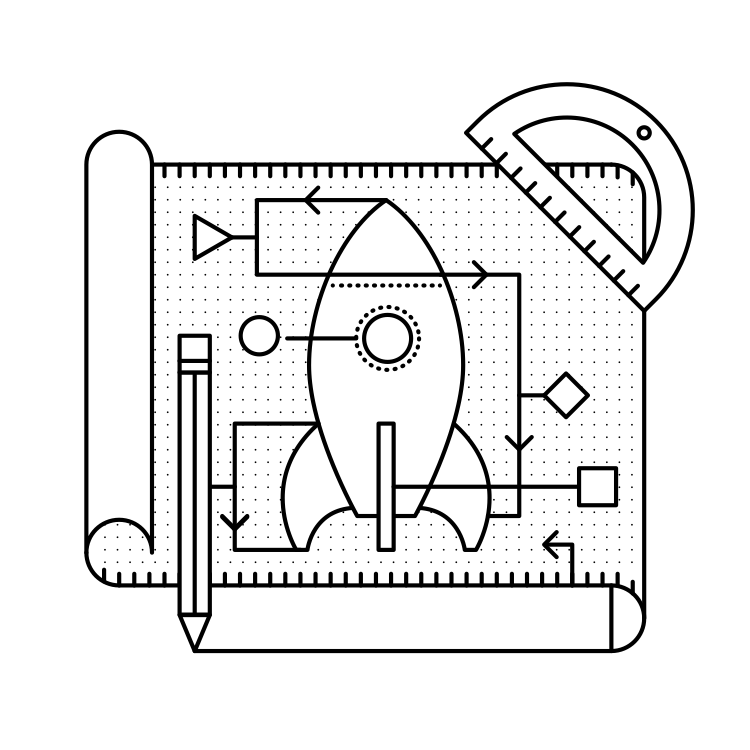

# 蓝图

## 什么是蓝图？

一个蓝图定义了可用于单个应用的视图，模板，静态文件等等的集合。举个例子，想象一下我们有一个用于管理面板的蓝图。这个蓝图将定义像*/admin/login*和*/admin/dashboard*这样的路由的视图。它可能还包括所需的模板和静态文件。你可以把这个蓝图当做你的应用的管理面板，管它是宇航员的交友网站，还是火箭推销员的CRM系统。

## 我什么时候会用到蓝图？

蓝图的杀手锏是将你的应用组织成不同的组件。假如我们有一个微博客，我们可能需要有一个蓝图用于网站页面，比如*index.html*和*about.html*。然后我们还需要一个用于在登录面板中展示最新消息的蓝图，以及另外一个用于管理员面板的蓝图。站点中每一个独立的区域也可以在代码上隔绝开来。最终你将能够把你的应用依据许多能完成单一任务的小应用组织起来。

> **参见**
> 从Flask文档中读到更多使用蓝图的理由
> [Why Blueprints](http://flask.pocoo.org/docs/blueprints/#why-blueprints)

## 我要把它们放哪里？

就像Flask里的每一件事情一样，你可以使用多种方式组织应用中的蓝图。对我而言，我喜欢按照功能(functional)而非分区(divisional)来组织。(这些术语是我从商业世界借来的)

### 功能式架构

在功能式架构中，按照每部分代码的功能来组织你的应用。所有模板放到同一个文件夹中，静态文件放在另一个文件夹中，而视图放在第三个文件夹中。

```
yourapp/
    __init__.py
    static/
    templates/
        home/
        control_panel/
        admin/
    views/
        __init__.py
        home.py
        control_panel.py
        admin.py
    models.py
```

除了*yourapp/views/__init__.py*，在*yourapp/views/*文件夹中的每一个*.py*文件都是一个蓝图。在*yourapp/__init__.py*中，我们将加载这些蓝图并在我们的`Flask()`对象中**注册**它们。等会我们将在本章了解到这是怎么实现的。

> **参见**
> 当我下笔之时， flask.pocoo.org（Flask官网）就是使用这样的结构的。 https://github.com/mitsuhiko/flask/tree/website/flask_website

### 分区式架构

在分区式架构中，按照每一部分所属的蓝图来组织你的应用。管理面板的所有的模板，视图和静态文件放在一个文件夹中，用户控制面板的则放在另一个文件夹中。

```
yourapp/
    __init__.py
    admin/
        __init__.py
        views.py
        static/
        templates/
    home/
        __init__.py
        views.py
        static/
        templates/
    control_panel/
        __init__.py
        views.py
        static/
        templates/
    models.py
```

在像上面列举的分区式结构，每一个*yourapp/*之下的文件夹都是一个独立的蓝图。所有的蓝图通过顶级的*__init__.py*注册到`Flask()`中。

### 哪种更胜一筹？

选择使用哪种架构实际上是一个个人问题。两者间的唯一区别是表达层次性的方式不同 -- 你可以使用任意一种方式架构Flask应用 -- 所以你所需的就是选择贴近你的需求的那个。

如果你的应用是由独立的，仅仅共享模型和配置的各组件组成，分区式将是个好选择。一个例子是允许用户建立网站的SaaS应用。你将会有独立的蓝图用于主页，控制面板，用户网站，和高亮面板。这些组件有着完全不同的静态文件和布局。如果你想要将你的蓝图提取成插件，或用之于别的项目，一个分区式架构将是正确的选择。

另一方面，如果你的应用的组件之间的联系较为紧密，使用功能式架构会更好。如果Facebook是用Flask开发的，它将有一系列蓝图，用于静态页面(比如登出主页，注册页面，关于，等等)，面板(比如最新消息)，用户内容(/robert/about和/robert/photos)，还有设置页面(/settings/security和/settingd/privacy)以及别的。这些组件都共享一个通用的布局和风格，但每一个都有它自己的布局。下面是一个非常精简的可能的Facebook结构，假定它用的是Flask。

```
facebook/
    __init__.py
    templates/
        layout.html
        home/
            layout.html
            index.html
            about.html
            signup.html
            login.html
        dashboard/
            layout.html
            news_feed.html
            welcome.html
            find_friends.html
        profile/
            layout.html
            timeline.html
            about.html
            photos.html
            friends.html
            edit.html
        settings/
            layout.html
            privacy.html
            security.html
            general.html
    views/
        __init__.py
        home.py
        dashboard.py
        profile.py
        settings.py
    static/
        style.css
        logo.png
    models.py
```

位于*facebook/view/*下的蓝图更多的是视图的集合而非独立的组件。同样的静态文件将被大多数蓝图重用。大多数模板都拓展自一个主模板。一个功能式的架构是组织这个项目的好的方式。

## 我该怎么使用它们？

### 基本用法

让我们看看来自Facebook例子的一个蓝图的代码：

facebook/views/profile.py
```python
from flask import Blueprint, render_template

profile = Blueprint('profile', __name__)

@profile.route('/<user_url_slug>')
def timeline(user_url_slug):
    # 做些处理
    return render_template('profile/timeline.html')

@profile.route('/<user_url_slug>/photos')
def photos(user_url_slug):
    # 做些处理
    return render_template('profile/photos.html')

@profile.route('/<user_url_slug>/about')
def about(user_url_slug):
    # 做些处理
    return render_template('profile/about.html')
```

要想创建一个蓝图对象，你需要import`Blueprint()`类并用参数`name`和`import_name`初始化。通常用`__name__`，一个表示当前模块的特殊的Python变量，作为`import_name`的取值。

假如使用分区式架构，你得告诉Flask某个蓝图是有着自己的模板和静态文件夹的。下面是这种情况下我们的定义大概的样子：

```
profile = Blueprint('profile', __name__,
                    template_folder='templates',
                    static_folder='static')
```

现在我们已经定义好了蓝图。是时候向Flask app注册它了。

facebook/__init__.py
```python
from flask import Flask
from .views.profile import profile

app = Flask(__name__)
app.register_blueprint(profile)
```

现在在*fackbook/views/profile.py*中定义的路径(比如`/<user_url_slug>`)会被注册到应用中，就像是被通过`@app.route()`定义的。

### 使用一个动态的URL前缀

继续看Facebook的例子，注意到所有的个人信息路由都以`<user_url_slug>`开头并把它传递给视图函数。我们想要用户通过类似*http://facebook.com/john.doe*的URL访问个人信息。通过给所有的蓝图的路由定义一个动态前缀，我们可以结束这种单调的重复。

蓝图允许我们定义静态的或动态的前缀。举个例子，我们可以告诉Flask蓝图中所有的路由应该以*/profile*作为前缀；这样是一个静态前缀。在Fackbook这个例子中，前缀取决于用户浏览的是谁的个人信息。他们在URL对应片段中输入的文本将决定我们输出的视图；这样是一个动态前缀。

我们可以选择何时定义我们的前缀。我们可以在下列两个时机中选择一个定义前缀：当我们实例化`Blueprint()`类的时候，或当我们在`app.register_blueprint()`中注册的时候。

下面我们在实例化的时候设置URL前缀：

facebook/views/profile.py
```python
from flask import Blueprint, render_template

profile = Blueprint('profile', __name__, url_prefix='/<user_url_slug>')

# [...]
```

下面我们在注册的时候设置URL前缀：

facebook/__init__.py
```python
from flask import Flask
from .views.profile import profile

app = Flask(__name__)
app.register_blueprint(profile, url_prefix='/<user_url_slug>')
```

尽管这两种方式在技术上没有区别，最好还是在注册的同时定义前缀。这使得前缀的定义可以集中到顶级目录中。因此，我推荐使用`url_prefix`。

我们可以在前缀中使用转换器(converters)，就像调用route()一样。同样也可以使用我们定义过的任意自定义转换器。通过这样做，我们可以自动处理在蓝图前缀中传递过来的值。在这个例子中，我们将根据URL片段获取用户类并传递到我们的profile蓝图中。我们将通过一个名为`url_value_preprocessor()`装饰器来做到这一点。

facebook/views/profile.py
```python
from flask import Blueprint, render_template, g

from ..models import User

# The prefix is defined in facebook/__init__.py.
profile = Blueprint('profile', __name__)

@profile.url_value_preprocessor
def get_profile_owner(endpoint, values):
    query = User.query.filter_by(url_slug=values.pop('user_url_slug'))
    g.profile_owner = query.first_or_404()

@profile.route('/')
def timeline():
    return render_template('profile/timeline.html')

@profile.route('/photos')
def photos():
    return render_template('profile/photos.html')

@profile.route('/about')
def about():
    return render_template('profile/about.html')
```

我们使用`g`对象来储存个人信息的拥有者，而g可以用于Jinja2模板上下文。这意味着在这个简单的例子中，我们仅仅需要渲染模板，需要的信息就能在模板中获取。

facebook/templates/profile/photos.html
```



    

```

> **参见**
> Flask文档中有一个关于如何将你的URL国际化的好教程： http://flask.pocoo.org/docs/patterns/urlprocessors/#internationalized-blueprint-urls }

### 使用一个动态子域名

今天，许多SaaS应用提供用户一个子域名来访问他们的软件。举个例子，Harvest，是一个针对顾问的日程管理软件，它在yourname.harvestapp.com给你提供了一个控制面板。下面我将展示在Flask中如何像这样自动生成一个子域名。

在这一节，我将使用一个允许用户创建自己的网站的应用作为例子。假设我们的应用有三个蓝图分别针对以下的部分：用户注册的主页面，可用于建立自己的网站的用户管理面板，用户的网站。考虑到这三个部分相对独立，我们将用分区式结构组织起来。

```
sitemaker/
    __init__.py
    home/
        __init__.py
        views.py
        templates/
            home/
        static/
            home/
    dash/
        __init__.py
        views.py
        templates/
            dash/
        static/
            dash/
    site/
        __init__.py
        views.py
        templates/
            site/
        static/
            site/
    models.py
```

| url                          | 蓝图目录       | 作用
| -----------------------------|-------------   | ----
| sitemaker.com/               | sitemaker/home | 一个普通的蓝图。包括用于*index.html*，*about.html*和*pricing.html*的视图，模板和静态文件。
| bigdaddy.sitemaker.com       | sitemaker/site | 这个蓝图使用了动态子域名，并包括了用户网站的一些元素。等下我们来看看用于实现这个蓝图的一些代码。
| bigdaddy.sitemaker.com/admin | sitemaker/dash | 这个蓝图将使用一个动态子域名和一个URL前缀，把这一节的技术和上一节的结合起来。

定义动态子域名的方式和定义URL前缀一样。同样的，我们可以选择在蓝图文件夹中，或在顶级目录的__init__.py中定义它。这一次，我们还是在*sitemaker/__init__.py*中放置所有的定义。

sitemaker/__init__.py
```python
from flask import Flask
from .site import site

app = Flask(__name__)
app.register_blueprint(site, subdomain='<site_subdomain>')
```

既然我们用的是分区式架构，蓝图将在*sitemaker/site/__init__.py*定义。

sitemaker/site/__init__py
```python
from flask import Blueprint

from ..models import Site

# 注意首字母大写的Site和全小写的site是两个完全不同的变量。
# Site是一个模块，而site是一个蓝图。

site = Blueprint('site', __name__)

@site.url_value_preprocessor
def get_site(endpoint, values):
    query = Site.query.filter_by(subdomain=values.pop('site_subdomain'))
    g.site = query.first_or_404()

# 在定义site后才import views。视图模块需要import 'site'，所以我们需要确保在import views之前定义site。
import .views
```

现在我们已经从数据库中获取可以向请求子域名的用户展示的站点信息了。

为了使Flask能够支持子域名，你需要修改配置变量`SERVER_NAME`。

*config.py*
```python
SERVER_NAME = 'sitemaker.com'
```

> **注意**
> 几分钟之前，当我正在打这一章的草稿时，聊天室中某人求助称他们的子域名能够在开发环境下正常工作，但在生产环境下就会失败。我问他们是否配置了`SERVER_NAME`，结果发现他们只在开发环境中配置了这个变量。在生产环境中设置这个变量解决了他们的问题。从这里可以看到我(imrobert)和aplavin之间的对话: http://dev.pocoo.org/irclogs/%23pocoo.2013-07-30.log

> **注意**
> 你可以同时设置一个子域名和URL前缀。想一下使用上面的表格的URL结构，我们要怎样来配置*sitemaker/dash*。

## 使用蓝图重构小型应用

我打算通过一个简单的例子来展示用蓝图重写一个应用的几个步骤。我们将从一个典型的Flask应用起步，然后重构它。

```
config.txt
requirements.txt
run.py
gnizama/
  __init__.py
  views.py
  models.py
  templates/
  static/
tests/
```

*views.py*文件已经膨胀到10,000行代码了。重构的工作被一推再推，到现在已经无路可退。这个文件包括了我们的网站的所有的视图，比如主页，用户面板，管理员面板，API和公司博客。

### Step 1：分区式还是功能式？

这个应用由关联较小的各部分构成。模板和静态文件不太可能在蓝图间共享，所以我们将使用分区式结构。

### Step 2：分而治之

> **注意**
> 在你对你的应用大刀阔斧之前，把一切提交到版本控制。你不会接受对任何有用的东西的意外删除。

接下来我们将继续前进，为我们的新应用创建目录树。从为每一个蓝图创建一个目录开始吧。然后整体复制*views.py*，*static/*和*templates/*到每一个蓝图文件夹。接着你可以从顶级目录删除掉它们了。

```
config.txt
requirements.txt
run.py
gnizama/
  __init__.py
  home/
    views.py
    static/
    templates/
  dash/
    views.py
    static/
    templates/
  admin/
    views.py
    static/
    templates/
  api/
    views.py
    static/
    templates/
  blog/
    views.py
    static/
    templates/
  models.py
tests/
```

### Step 3：大扫除

现在我们可以到每一个蓝图中，移除无关的视图，静态文件和模板。你在这一阶段的处境很大程度上取决于一开始你是怎么组织你的应用的。

最终结果应该是：每个蓝图有一个`views.py`包括了蓝图里的所有视图，没有两个蓝图对同一个路由定义了视图；每一个*templates/*文件夹应该只包括该蓝图所需的模板；每一个*static/*文件夹应该只包括该蓝图所需的静态文件。

> **注意**
> 趁此机会消除所有不必要的import。很容易忽略掉他们的存在，但他们会拥塞你的代码，甚至拖慢你的应用。

### Step 4：蓝图

在这一部分我们把文件夹转换成蓝图。关键在于*__init__.py*文件。作为开始，让我们看一下API蓝图的定义。

_gnizama/api/__init__.py_
```python
from flask import Blueprint

api = Blueprint(
    'site',
    __name__,
    template_folder='templates',
    static_folder='static'
)

import .views
```

接着我们可以在gnizama的顶级目录下的*__init__.py*中注册这个蓝图。

_gnizama/__init__.py_
```python
from flask import Flask
from .api import api

app = Flask(__name__)

# 在api.gnizama.com中添加API蓝图
app.register_blueprint(api, subdomain='api')
```

确保路由现在是在蓝图中注册的，而不是在app对象。下面是在我们重构应用之前，一个在*gnizama/views.py*的API路由可能的样子。

_gnizama/views.py_
```python
from . import app

@app.route('/search', subdomain='api')
def api_search():
    pass
```

在蓝图中它看上去像这样：

_gnizama/api/views.py_
```python
from . import api

@api.route('/search')
def search():
    pass
```

### Step 5：大功告成

现在我们的应用已经比只有单个臃肿的*views.py*的时候更加模块化了。

## 总结

* 一个蓝图包括了可以作为独立应用的视图，模板，静态文件和其他插件。
* 蓝图是组织你的应用的好办法。
* 在分区式架构下，每个蓝图对应你的应用的一个部分。
* 在功能式架构下，每个蓝图就只是视图的集合。所有的模板和静态文件都放在一块。
* 要使用蓝图，你需要定义它，并在应用中用`Flask.register_blueprint()`注册它。
* 你可以给一个蓝图中的所有路由定义一个动态URL前缀。
* 你也可以给蓝图中的所有路由定义一个动态子域名。
* 仅需五步走，你可以用蓝图重构一个应用。
